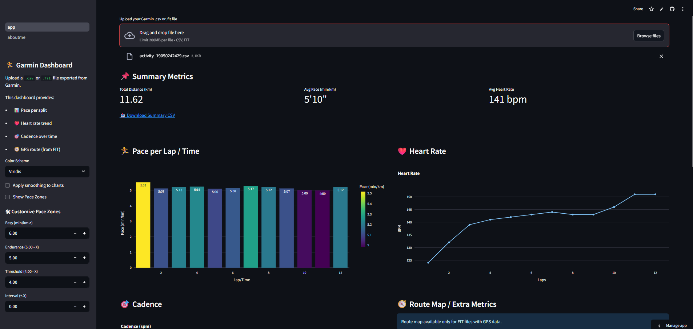
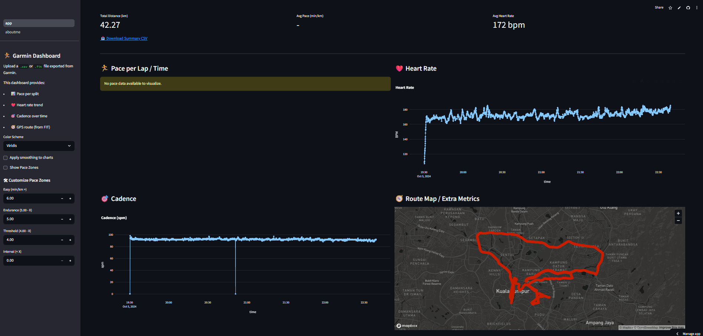

# Garmin Health & Performance Dashboard


A Streamlit-based web application that allows you to upload and analyze health data exported from Garmin or Strava devices. This dashboard supports `.csv` and `.fit` files, and provides visual insights into pace, heart rate, cadence, GPS route, and more.

## 🚀 Features

- 📁 Upload `.csv` or `.fit` health data files
- 📊 Visualize pace, heart rate, cadence, and GPS map
- 🔄 Customizable pace zones with color-coded bar charts
- 📈 Scatter plot comparison for any two numeric metrics
- 🧠 Pie chart summary of time spent in each pace zone
- 📥 Export summary as CSV

## 📂 File Types Supported

- Garmin `.csv` export with split data
- Garmin `.fit` files (with GPS, HR, cadence, pace, etc.)

## 🧰 Built With

- [Streamlit](https://streamlit.io/)
- [pandas](https://pandas.pydata.org/)
- [plotly](https://plotly.com/python/)
- [fitparse](https://github.com/dtcooper/python-fitparse)

## 🔧 Setup Instructions

1. Clone this repo:
```bash
git clone https://github.com/Ether-silicon/Garmin_Analytic_Dashboard
cd <your-repo>
```
2. (Optional) Create a virtual environment:
```bash
python -m venv venv
source venv/bin/activate   # or .\venv\Scripts\activate on Windows
```
3. Install dependencies:
```bash
pip install -r requirements.txt
```
4. Run the app:
```bash
streamlit run app.py
```

## 📁 Project Structure
```
├── app.py               # Main Streamlit dashboard
├── /pages               # Additional pages (e.g., About Author)
├── data_parser.py       # Functions for parsing .csv and .fit files
├── requirements.txt     # Python dependencies
└── README.md            # You're here :)
```

## 🧭 App usage





## ✍️ Author

**Yoong Sin**  
Data Science Engineer @ Coherent • Master's in Data Science, Universiti Teknologi Petronas

- [LinkedIn](https://www.linkedin.com/in/tehyoongsin/)
- [GitHub](https://github.com/Ether-silicon)

---

🧡 Feel free to fork this project, suggest improvements, or use it to build your own health tracking dashboard!
